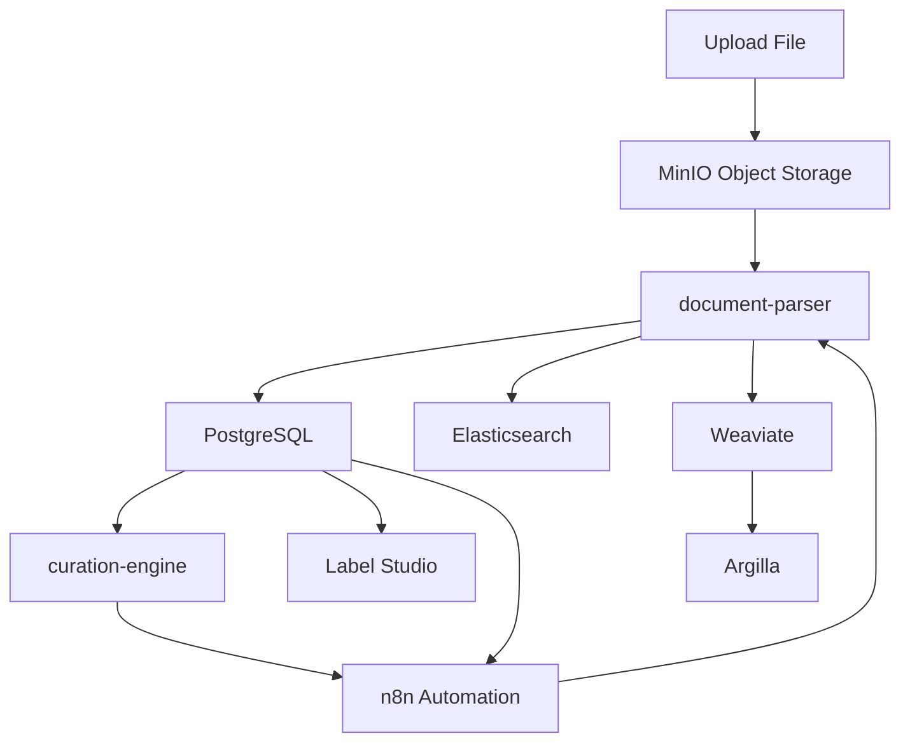

# Semblance Data Curation Workflow

> Data ingestion, document parsing, and indexing backend for the Semblance AI stack. Supports multi-format ingestion and both full-text and semantic (vector) search. Built for high-fidelity document curation pipelines.
> **Data ingestion, parsing, and indexing backend for the Semblance AI stack.**
> Supports multi-format ingestion with both full-text and semantic (vector) search capabilities. Built for high-fidelity document curation pipelines.

[](https://docs.docker.com/compose/)
[](https://www.postgresql.org/)
[](https://github.com/pgvector/pgvector)
[](https://www.elastic.co/)
[](https://weaviate.io/)
[](https://min.io/)
[](https://labelstud.io/)
[](https://argilla.io/)
[](https://n8n.io/)
[](./LICENSE)

---

## Overview

Semblance Curation is responsible for:

* **Document Ingestion**: Uploading and storing raw documents.
* **Parsing**: Extracting text and metadata from various document formats.
* **Indexing**: Enabling both keyword-based and semantic search capabilities.
* **Annotation**: Facilitating human-in-the-loop and model-in-the-loop annotations.
* **Automation**: Orchestrating workflows for seamless document processing.

---

## Stack Components

| Service             | Description                                                                                         |
| ------------------- | --------------------------------------------------------------------------------------------------- |
| **MinIO**           | S3-compatible object storage for raw document uploads.                                              |
| **document-parser** | Parses PDFs, EPUBs, HTML, etc., into plaintext.                                                     |
| **PostgreSQL**      | Stores metadata and document registry.                                                              |
| **pgvector**        | Adds vector similarity search capabilities to PostgreSQL.                                           |
| **Elasticsearch**   | Provides full-text keyword-based search.                                                            |
| **Weaviate**        | Offers vector-based semantic search.                                                                |
| **weaviate-setup**  | Bootstraps schema and configuration into Weaviate.                                                  |
| **curation-engine** | Orchestrates ingestion and tracking (in development).                                               |
| **Label Studio**    | Web-based UI for human-in-the-loop annotation.                                                      |
| **Argilla**         | Dataset-oriented annotation & feedback platform with LLM integration support.                       |
| **n8n**             | Low-code workflow automation engine for orchestrating ingestion, indexing, and annotation triggers. |

---

## 🕸️ Architecture Diagram



---

## Workflow Summary

1. **Upload**: Files are uploaded to MinIO (`/uploads` bucket).
2. **Parse**: `document-parser` extracts text and metadata.
3. **Store**: Outputs are stored in PostgreSQL, tracking status/state.
4. **Index**:

   * **Elasticsearch**: For full-text keyword-based search.
   * **Weaviate**: For vector-based semantic search.
5. **Annotate**:

   * **Label Studio**: For human-in-the-loop annotations.
   * **Argilla**: For model-in-the-loop feedback and fine-tuning data collection.
6. **Automate**: `n8n` orchestrates workflows, triggers, and integrations.

---

##  Getting Started

###  Prerequisites

* Docker & Docker Compose installed.
* At least 6–8 GB RAM available (Weaviate and Elasticsearch are resource-intensive).

### Quickstart

```bash
git clone https://github.com/eooo-io/semblance-curation.git
cd semblance-curation
cp .env-example .env
docker-compose up --build
```

---

## ⚙️ Configuration

### Environment Variables

All secrets and configurations are stored in `.env` and used by `docker-compose`.

Example `.env` file:

```dotenv
# MinIO (S3-compatible storage)
MINIO_ROOT_USER=admin
MINIO_ROOT_PASSWORD=admin123

# PostgreSQL
POSTGRES_USER=curation
POSTGRES_PASSWORD=curation
POSTGRES_DB=curation

# n8n Automation
N8N_USER=admin
N8N_PASS=admin123
```

> **Note**: For production use, consider migrating secrets to Docker secrets or using environment variable overrides.

---

## Service Access

| Service          | URL                                            | Default Credentials         |
| ---------------- | ---------------------------------------------- | --------------------------- |
| MinIO            | [http://localhost:9000](http://localhost:9000) | `admin` / `admin123`        |
| Weaviate Console | [http://localhost:8080](http://localhost:8080) | None (local access only)    |
| Elasticsearch    | [http://localhost:9200](http://localhost:9200) | `elastic` / `changeme`      |
| PostgreSQL       | localhost:5432                                 | `curation` / `curation`     |
| Label Studio     | [http://localhost:8081](http://localhost:8081) | Set on first run (admin UI) |
| Argilla          | [http://localhost:6900](http://localhost:6900) | `admin` / `argilla`         |
| n8n              | [http://localhost:5678](http://localhost:5678) | `admin` / `admin123`        |

---

## Roadmap

* [x] MinIO + file upload
* [x] Parsing service for PDFs, HTML, EPUB
* [x] Weaviate + Elasticsearch indexing
* [ ] `curation-engine` service logic (tracking + retry)
* [ ] Add FastAPI interface for uploads and queries
* [ ] Add Celery/RQ for background jobs
* [ ] RBAC & multi-user support

---

## Related Projects

* [Semblance AI (orchestration layer)](https://github.com/eooo-io/semblance-ai)
* [Semblance RAG (retrieval + API)](https://github.com/eooo-io/semblance-rag)

---

## License

MIT – use freely, modify boldly, attribute generously.


