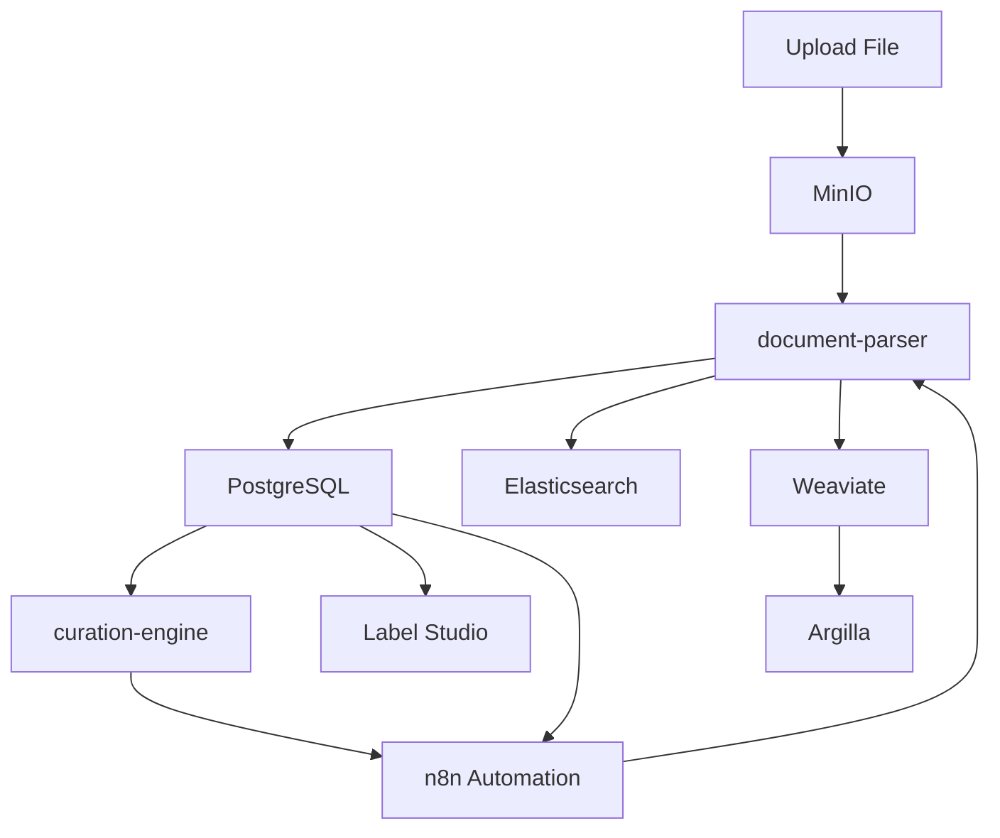

# Semblance Data Curation Setup

> **Data ingestion, parsing, and indexing backend for the Semblance AI stack.**  
> Built for high-fidelity document pipelines with both full-text and semantic search capabilities, annotation support, and automation workflows.

---
[](https://docs.docker.com/compose/)
[](https://www.postgresql.org/)
[](https://github.com/pgvector/pgvector)
[](https://www.elastic.co/)
[](https://weaviate.io/)
[](https://min.io/)
[](https://labelstud.io/)
[](https://argilla.io/)
[](https://n8n.io/)
[](./LICENSE)

---

## Overview

Semblance Curation is the document preparation and ingestion subsystem of the Semblance AI project. It handles:

- **Multi-format ingestion**
- **Semantic + keyword search**
- **Human and LLM annotation**
- **Automated document workflows**

---

## Stack Components

| Service             | Description |
|---------------------|-------------|
| **MinIO**           | S3-compatible object storage for raw document uploads. |
| **document-parser** | Converts documents (PDF, EPUB, HTML, etc.) into clean plaintext. |
| **PostgreSQL**      | Metadata storage, ingestion tracking. |
| **pgvector**        | Adds vector search support to Postgres. |
| **Elasticsearch**   | Keyword-based search engine. |
| **Weaviate**        | Semantic vector search with schema support. |
| **weaviate-setup**  | Schema/bootstrap script for Weaviate. |
| **curation-engine** | Orchestration layer for ingestion & sync logic (WIP). |
| **Label Studio**    | Manual UI for human annotations. |
| **Argilla**         | Feedback & annotation for model tuning. |
| **n8n**             | Automation engine for workflow triggers & chaining. |

---

## Architecture Diagram



---

## Workflow

1. **Upload** to MinIO
2. **Parse** via document-parser
3. **Store** metadata + content in PostgreSQL
4. **Index** to Elastic + Weaviate
5. **Annotate** via Label Studio or Argilla
6. **Automate** with n8n webhooks or scheduled tasks

---

## Getting Started

### Prerequisites

- Docker + Docker Compose
- 6–8 GB RAM minimum (Weaviate + Elastic)

### Setup

```bash
git clone https://github.com/eooo-io/semblance-curation.git
cd semblance-curation
cp .env-example .env
docker-compose up --build
```

---

## Environment Variables

`.env-example`:

```dotenv
# MinIO (S3-compatible)
MINIO_ROOT_USER=admin
MINIO_ROOT_PASSWORD=admin123

# PostgreSQL
POSTGRES_USER=curation
POSTGRES_PASSWORD=curation
POSTGRES_DB=curation

# n8n Workflow UI
N8N_USER=admin
N8N_PASS=admin123
```

---

## Service Access

| Tool              | URL                      | Credentials         |
|-------------------|---------------------------|---------------------|
| MinIO             | http://localhost:9000     | admin / admin123    |
| Weaviate UI       | http://localhost:8080     | None                |
| Elasticsearch     | http://localhost:9200     | elastic / changeme  |
| PostgreSQL        | localhost:5432            | curation / curation |
| Label Studio      | http://localhost:8081     | set on first use    |
| Argilla           | http://localhost:6900     | admin / argilla     |
| n8n               | http://localhost:5678     | admin / admin123    |

---

## Deployment Targets & Resource Requirements

| Mode              | Target                             | Use Case                              |
|-------------------|-------------------------------------|----------------------------------------|
| 🖥️ Local Dev       | Workstation/Laptop (Docker Compose) | Development & testing                 |
| ☁️ VPS/Bare Metal | Hetzner, EC2, Linode, etc.         | Production self-hosted                |
| ⚡ Serverless      | FaaS triggers + managed backends    | Doc-by-doc burst processing           |

### Local Dev Requirements

| Resource   | Minimum 🟥        | Recommended 🟩          |
|------------|-------------------|--------------------------|
| CPU        | 4 cores            | 8+ physical cores         |
| RAM        | 8 GB               | 16–32 GB                 |
| Disk       | 20 GB SSD          | 50–100 GB NVMe           |

### ☁️ VPS/Bare Metal

| Component   | Suggested             |
|-------------|------------------------|
| CPU         | 8 vCPU+                |
| RAM         | 32 GB                  |
| Disk        | 100 GB SSD/NVMe        |
| GPU (opt)   | For LLM eval/feedback  |

> 💡 Serverless integration works great for triggering parsing/indexing pipelines via n8n workflows and webhook handlers, while keeping storage/indexing in cloud-native services.

---

## Related Repos

- [`semblance-ai`](https://github.com/eooo-io/semblance-ai): Orchestration / dashboard
- [`semblance-rag`](https://github.com/eooo-io/semblance-rag): Retrieval + LLM interface

---

## License

This project is licensed under the [MIT License](./LICENSE).  
Use freely, fork loudly, and remember to share knowledge.

---
