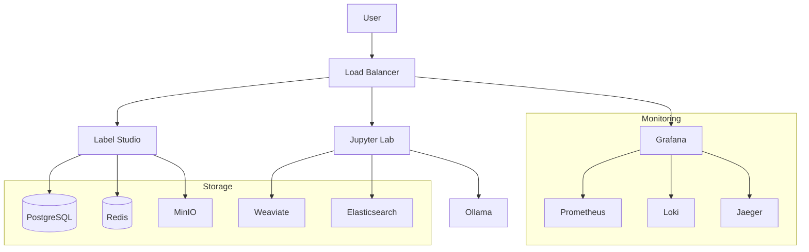

# Architecture Overview

Semblance Curation is built as a microservices architecture, combining best-in-class tools for ML dataset curation and management.

## Core Components

### Label Studio
- Primary interface for data annotation and curation
- Multi-type data labeling support
- Standardized output format
- Integration with ML models
- REST API for automation

### Data Storage
- **PostgreSQL**: Primary database for structured data
- **Redis**: Caching and real-time features
- **MinIO**: Object storage for large files
- **Elasticsearch**: Full-text search and analytics
- **Weaviate**: Vector database for ML features

### ML Components
- **Ollama**: Local LLM inference
- **MLflow**: ML experiment tracking
- **Jupyter**: Interactive development

### Monitoring Stack
- **Prometheus**: Metrics collection
- **Grafana**: Visualization and dashboards
- **Loki**: Log aggregation
- **Jaeger**: Distributed tracing

## System Architecture



## Container Organization

The stack is organized using Docker Compose with the following structure:

```yaml
services:
  app:           # Main application (Label Studio)
  postgres:      # Database
  redis:         # Cache
  elasticsearch: # Search
  minio:         # Object storage
  weaviate:      # Vector DB
  ollama:        # LLM inference
  prometheus:    # Metrics
  grafana:       # Dashboards
  loki:          # Logs
  jaeger:        # Tracing
```

## Data Flow

1. **Input Data Flow**:
   - Raw data ingestion through Label Studio UI or API
   - Storage in MinIO for large files
   - Metadata in PostgreSQL
   - Search indices in Elasticsearch
   - Vector embeddings in Weaviate

2. **Processing Flow**:
   - Annotation in Label Studio
   - ML model integration via Ollama
   - Experiment tracking in MLflow
   - Custom processing in Jupyter

3. **Output Flow**:
   - Standardized annotation export
   - ML model training data
   - Quality metrics and statistics
   - Monitoring and analytics

## Security Architecture

1. **Authentication**:
   - Label Studio user management
   - API key authentication
   - Service-to-service auth

2. **Authorization**:
   - Role-based access control
   - Resource-level permissions
   - API scope control

3. **Data Security**:
   - Encrypted storage
   - Secure communication
   - Access logging

## Monitoring Architecture

1. **Metrics Collection**:
   - System metrics via Prometheus
   - Application metrics
   - ML model metrics
   - Custom business metrics

2. **Logging**:
   - Centralized logging with Loki
   - Structured log format
   - Log retention policies

3. **Tracing**:
   - Distributed tracing with Jaeger
   - Performance monitoring
   - Request tracking

## Development Architecture

The development setup includes additional features:

1. **Local Development**:
   - Hot reload capability
   - Debug logging
   - Development tools
   - Documentation server

2. **Testing**:
   - Unit test framework
   - Integration tests
   - Performance tests
   - Security tests

3. **CI/CD**:
   - Automated builds
   - Multi-arch support
   - Automated testing
   - Deployment automation

## Next Steps

- [Deployment Guide](../deployment/index.md)
- [Configuration Guide](../configuration/index.md)
- [Security Guide](../configuration/security.md)
- [Monitoring Guide](../features/monitoring/index.md) 
